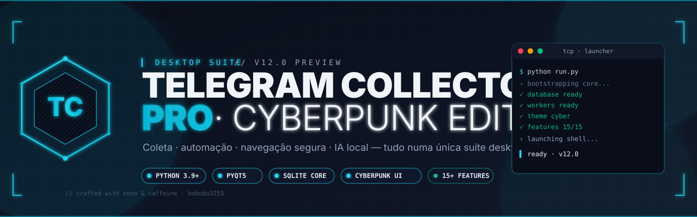

<div align="center">
  
</div>

# Guia de Contribuição

Obrigado pelo interesse em contribuir com o **Telegram Collector Pro**! Este documento descreve o fluxo, padrões e expectativas para contribuições.

---

## Visão geral

- **Linguagem:** Python 3.9+ com PyQt5 5.15+.
- **Estilo:** PEP 8 + tipagem progressiva (`from __future__ import annotations`).
- **Documentação:** ver [`docs/ARCHITECTURE.md`](docs/ARCHITECTURE.md), [`docs/DESIGN_SYSTEM.md`](docs/DESIGN_SYSTEM.md) e [`docs/PROJECT_STRUCTURE.md`](docs/PROJECT_STRUCTURE.md) **antes** de abrir um PR.

## Setup local

```bash
git clone https://github.com/bobobu3255/teste.git
cd teste
python -m venv .venv
source .venv/bin/activate         # Linux / macOS
# .venv\Scripts\activate          # Windows
pip install -r requirements.txt
python run.py
```

## Fluxo de branches

```
main                         ← sempre estável
  ├── feat/<escopo>-<curto>  ← novas features
  ├── fix/<escopo>-<curto>   ← correções
  ├── docs/<tema>            ← documentação
  ├── design/<tema>          ← mudanças puramente visuais
  └── chore/<tema>           ← infra / build / scripts
```

Branches descritivas e curtas. Exemplos:
- `feat/temp-mail-bulk-import`
- `fix/browser-proxy-leak`
- `design/sidebar-glow`

## Padrão de commits

Adotamos **Conventional Commits**:

```
<tipo>(<escopo opcional>): <resumo no imperativo>
```

Tipos aceitos: `feat`, `fix`, `docs`, `style`, `refactor`, `perf`, `test`, `build`, `ci`, `chore`, `design`.

Exemplos:
```
feat(browser): adiciona import de proxies em lote
fix(crunchyroll): corrige timeout no fluxo de login
design(sidebar): aplica glow cyan no item ativo
docs(architecture): documenta fluxo de workers
```

## Padrões de código

### Imports
- **Sempre absolutos** (`from app.core.database import ...`).
- **Sem imports cruzados entre features**. Para colaboração entre features, use serviços ou app store.

### Estilos (QSS)
- **Proibido** hex hard-coded — todas as cores vêm de `app/ui/app_theme.py`.
- Cada feature mantém seu próprio `styles.py`.
- Estados (`:hover`, `:focus`, `:disabled`) são obrigatórios para qualquer elemento interativo.

### Logging
- Usar `logger_manager.get_logger(__name__)` em todos os módulos.
- `print()` é proibido em código de produção (apenas em scripts utilitários).

### Tipagem
- Funções públicas devem ter assinatura tipada.
- Use `from __future__ import annotations` em arquivos novos.

## Adicionando uma nova feature

1. Criar `app/features/<nome>/` com:
   ```
   __init__.py    # exporta o widget principal
   widget.py      # QWidget raiz
   styles.py      # QSS local consumindo o tema
   dialog.py      # opcional
   ```
2. Registrar em `app/features/registry.py`.
3. Adicionar título da aba em `main_app.SimpleApp.TAB_TITLES`.
4. Garantir que `widget_smoke_check.py` passa.
5. Atualizar README e CHANGELOG.

## Auditorias antes do PR

```bash
python scripts/maintenance/verify_all.py
```

Pipeline obrigatório que executa:
- `health_check.py`
- `structure_guard.py`
- `app_store_check.py`
- `widget_smoke_check.py`
- `ui_style_audit.py`

Todos devem passar antes de abrir o PR.

## Pull Requests

Um bom PR contém:

- [ ] Descrição clara do problema e da solução.
- [ ] Screenshots ou GIFs para mudanças visuais.
- [ ] Referência a issue (`Closes #123`) quando aplicável.
- [ ] Atualização de `CHANGELOG.md` na seção `[Unreleased]`.
- [ ] Auditorias passando localmente.

### Template sugerido

```md
## Contexto
<por que esta mudança é necessária>

## O que mudou
<lista objetiva>

## Como testar
<passos>

## Screenshots
<antes / depois>

## Checklist
- [ ] Auditorias passando
- [ ] CHANGELOG atualizado
- [ ] Sem hex hard-coded
- [ ] Documentação atualizada
```

## Reportando bugs

Use as **Issues** do GitHub. Inclua:
- Versão do app (ex.: `12.0-preview`)
- Sistema operacional
- Passos para reproduzir
- Logs relevantes (`%APPDATA%/TelegramCollectorPro/logs/` ou `~/.local/share/...`)
- Screenshots quando visual

## Código de conduta

Respeito mútuo e foco técnico. Discussões sobre mérito do código, nunca sobre a pessoa que o escreveu. Linguagem ofensiva, assédio ou comportamento discriminatório resultam em remoção da contribuição.

---

<div align="right">
  <sub>Contribuição · v12.0 preview</sub>
</div>
