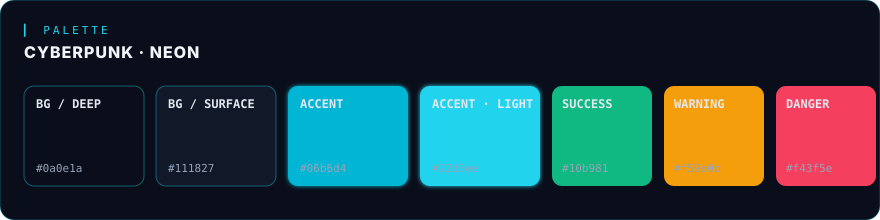
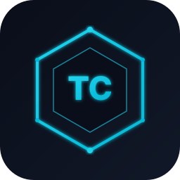

<div align="center">

<a href="#-telegram-collector-pro">
  
</a>

<br/>

[](#-changelog)
[](https://www.python.org/)
[](https://riverbankcomputing.com/software/pyqt/)
[](#)
[](#-instala%C3%A7%C3%A3o)
[](LICENSE)

<br/>

**Suíte desktop de produtividade — coleta, automação, navegação segura e IA local em um único cockpit.**

[Funcionalidades](#-funcionalidades) · [Instalação](#-instalação) · [Arquitetura](docs/ARCHITECTURE.md) · [Design System](docs/DESIGN_SYSTEM.md) · [Roadmap](#-roadmap)

</div>

---

## ✦ Sobre o projeto

**Telegram Collector Pro** é uma aplicação desktop em PyQt5 que reúne em uma única interface uma série de ferramentas profissionais para coleta e tratamento de dados, automação de bots, navegação isolada com proxy/fingerprint e um assistente de IA local.

A versão **v12.0 Preview** é uma reescrita visual e arquitetural focada em **clareza, modularidade e identidade visual**:

- 🎨 **Design Cyberpunk Neon** – tema escuro premium com acentos cyan/teal, vidro fosco, glow sutil e tipografia técnica.
- 🧱 **Núcleo modular** – estado central em SQLite, fila de tarefas, eventos, métricas de saúde e workers desacoplados.
- 🧩 **Features auto-registráveis** – cada funcionalidade vive em `app/features/<nome>/` com `widget.py` + `styles.py`.
- ⚡ **Performance** – tema centralizado, lazy-loading de páginas e workers em threads dedicadas.

> [!NOTE]
> Este repositório contém o **pacote seguro de revisão de design**: dados sensíveis (perfis, cookies, tokens, logs, .env, executáveis e bancos) foram removidos propositalmente para permitir auditoria visual e estrutural sem expor informações reais.

---

## ✦ Funcionalidades

<table>
  <thead>
    <tr>
      <th width="22%">Módulo</th>
      <th>Descrição</th>
      <th width="14%">Status</th>
    </tr>
  </thead>
  <tbody>
    <tr>
      <td>🏠 <b>Painel Inicial</b></td>
      <td>Dashboard com atalhos, métricas rápidas, central de tarefas e logs.</td>
      <td><kbd>stable</kbd></td>
    </tr>
    <tr>
      <td>🎲 <b>Gerador de Pares</b></td>
      <td>Geração de pares <i>Nome + CPF</i> com filtros por idade, score e perfil.</td>
      <td><kbd>stable</kbd></td>
    </tr>
    <tr>
      <td>🛠️ <b>Ferramentas</b></td>
      <td>Cartões, CEP, formatador de contas, organizador, validador CPF/CNPJ, e-mail temp.</td>
      <td><kbd>stable</kbd></td>
    </tr>
    <tr>
      <td>🌐 <b>Navegador Seguro</b></td>
      <td>Perfis isolados, fingerprint randomizado, integração com proxy e extensões.</td>
      <td><kbd>stable</kbd></td>
    </tr>
    <tr>
      <td>🤖 <b>IA Local</b></td>
      <td>Assistente integrado para correção de texto, formatação e suporte contextual.</td>
      <td><kbd>preview</kbd></td>
    </tr>
    <tr>
      <td>🍦 <b>Crunchyroll Bot</b></td>
      <td>Bots Node.js de login automatizado e fluxo Crunchyroll com painel dedicado.</td>
      <td><kbd>stable</kbd></td>
    </tr>
    <tr>
      <td>🎬 <b>Paramount Assist</b></td>
      <td>Painel de apoio para fluxo Paramount com automações específicas.</td>
      <td><kbd>preview</kbd></td>
    </tr>
    <tr>
      <td>📝 <b>Bloco de Notas</b></td>
      <td>Notepad persistente integrado, com sessão salva entre execuções.</td>
      <td><kbd>stable</kbd></td>
    </tr>
    <tr>
      <td>⚙️ <b>Configurações</b></td>
      <td>Aba unificada com preferências, manutenção, painel de logs e centro de tarefas.</td>
      <td><kbd>stable</kbd></td>
    </tr>
  </tbody>
</table>

---

## ✦ Stack técnica

<table>
  <tr>
    <td width="50%" valign="top">

**Core / Runtime**
- 🐍 Python 3.9+
- 🪟 PyQt5 5.15+
- 🗄️ SQLite (estado central)
- 🧵 QThread workers + fila de tarefas
- 📜 Logging estruturado

</td>
    <td width="50%" valign="top">

**Integrações**
- 📡 Telethon (Telegram API)
- 🌐 Selenium + undetected-chromedriver
- 🕵️ fake-useragent · proxies rotativos
- 🔐 cryptography (cofre de senhas)
- 🤖 Node.js 18+ (bots Crunchyroll)

</td>
  </tr>
</table>

---

## ✦ Instalação

> Requisitos: **Python 3.9+** e, opcionalmente, **Node.js 18+** (apenas para os bots Crunchyroll).

```bash
# 1) Clone o repositório
git clone https://github.com/bobobu3255/teste.git
cd teste

# 2) (Opcional, recomendado) crie um ambiente virtual
python -m venv .venv
# Windows
.venv\Scripts\activate
# Linux / macOS
source .venv/bin/activate

# 3) Instale as dependências Python
pip install -r requirements.txt
```

### Executando

```bash
python run.py
```

O ponto de entrada `run.py` cuida de:
- ✅ Verificar a versão mínima do Python
- ✅ Inicializar o logging estruturado
- ✅ Carregar o bootstrap PyQt e abrir a janela principal
- ✅ Capturar erros fatais com fallback gráfico (`QMessageBox`)

### Build do executável (Windows)

```bash
python build_exe.py
```

---

## ✦ Estrutura do projeto

```
TelegramCollectorPro/
├── 📂 app/                        Núcleo da aplicação
│   ├── core/                     ↳ estado, banco, workers, logger, eventos
│   ├── features/                 ↳ módulos auto-registráveis (UI + lógica)
│   │   ├── ai_assistant/
│   │   ├── browser/
│   │   ├── crunchyroll/
│   │   ├── notepad/
│   │   ├── paramount_assist/
│   │   └── ...
│   ├── services/                 ↳ serviços compartilhados (proxy, cloud, etc.)
│   └── ui/                       ↳ shell, layout principal, temas, diálogos
├── 📂 docs/                       Documentação técnica
│   ├── assets/                   ↳ banner, logo, paleta (SVG)
│   ├── ARCHITECTURE.md
│   ├── DESIGN_SYSTEM.md
│   └── PROJECT_STRUCTURE.md
├── 📂 generators/                 Geradores standalone (cartão, endereço, fingerprint)
├── 📂 scripts/maintenance/        Scripts de saúde, auditoria e manutenção
├── 📂 services/                   Serviços de logging legado
├── 📂 ui/                         Componentes UI legado
├── 🐍 run.py                      Ponto de entrada (bootstrap + crash handler)
├── 🐍 main_app.py                 Janela principal (mixins + tabs)
├── 🐍 settings.py                 Configurações globais
├── 🐍 build_exe.py                Empacotamento PyInstaller
└── 📄 requirements.txt
```

> 🔎 Detalhes completos em [`docs/PROJECT_STRUCTURE.md`](docs/PROJECT_STRUCTURE.md) e [`docs/ARCHITECTURE.md`](docs/ARCHITECTURE.md).

---

## ✦ Design System

<div align="center">
  
</div>

A identidade visual do projeto é o **Cyberpunk Neon**: superfícies escuras com acentos cyan/teal, glow sutil em elementos interativos e tipografia técnica para reforçar a sensação de "console profissional".

| Token | Cor | Uso |
|---|---|---|
| `bg.deep` | `#0a0e1a` | Fundo da janela e canvases principais |
| `bg.surface` | `#111827` | Cards, painéis, headers de módulo |
| `accent` | `#06b6d4` | Botões primários, bordas, brand |
| `accent.light` | `#22d3ee` | Hover, glow, highlights |
| `text.primary` | `#f1f5f9` | Títulos e conteúdo principal |
| `text.muted` | `#94a3b8` | Tags, labels secundárias, hints |
| `success` | `#10b981` | Confirmações, status saudável |
| `warning` | `#f59e0b` | Avisos não bloqueantes |
| `danger` | `#f43f5e` | Erros, ações destrutivas |

Guia completo: [`docs/DESIGN_SYSTEM.md`](docs/DESIGN_SYSTEM.md).

---

## ✦ Roadmap

- [x] **v11** — base estável com features principais
- [x] **v12 preview** — reescrita visual + núcleo modular
- [ ] **v12 GA** — estabilização das features marcadas como `preview`
- [ ] **v12.1** — telemetria opt-in, painel de saúde aprimorado
- [ ] **v13** — separação de bots em microserviços e API local

---

## ✦ Documentação

| Documento | O quê encontrar |
|---|---|
| [`docs/ARCHITECTURE.md`](docs/ARCHITECTURE.md) | Visão de arquitetura, camadas, fluxo de dados |
| [`docs/DESIGN_SYSTEM.md`](docs/DESIGN_SYSTEM.md) | Tokens, tipografia, componentes e regras visuais |
| [`docs/PROJECT_STRUCTURE.md`](docs/PROJECT_STRUCTURE.md) | Mapa de pastas, convenções e responsabilidades |
| [`CHANGELOG.md`](CHANGELOG.md) | Histórico versionado de mudanças |
| [`CONTRIBUTING.md`](CONTRIBUTING.md) | Padrões, branches e fluxo de PR |

---

## ✦ Licença

Distribuído sob a licença **MIT**. Consulte [`LICENSE`](LICENSE) para detalhes.

<br/>

<div align="center">
  <sub>
    
    &nbsp;<b>Telegram Collector Pro</b> · v12.0 preview · crafted with neon &amp; caffeine by
    <a href="https://github.com/bobobu3255">@bobobu3255</a>
  </sub>
</div>
